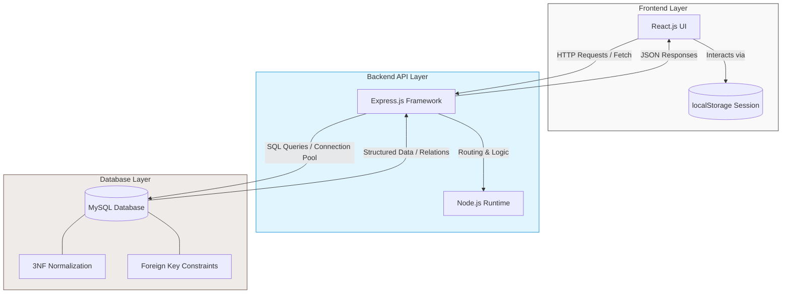

🏠 Hostel and PG Management System

A Full-Stack React & MySQL Application for Seamless Accommodation Management

 
 🚀 Project Milestone
 
This project served as my **Final Year BCA Capstone**. It was successfully defended in the 6th-semester viva with a **100% error-free workflow** demonstration.

✨ Features

- **Student Module:** Room availability checks, booking requests, and profile management.
- **Admin Module:** Real-time dashboard for room allocation, fee tracking, and student records.
- **Relational Integrity:** Managed complex student-room relationships using MySQL foreign keys.
- **Responsive UI:** Fully functional React frontend designed for clarity and ease of use.

🛠️ Tech Stack

- **Frontend:** React.js
- **Backend:** Node.js, Express.js
- **Database:** MySQL (Relational)
- **Authentication:** localStorage

### 📐 System Architecture

📊 Database Design

The system utilizes a structured relational schema to ensure ACID compliance:
- **Normalization:** Designed up to 3NF to eliminate data redundancy.
- **Relationships:** One-to-Many relationships between Rooms and Students.
- **Logic:** Optimized SQL queries for efficient data retrieval and updates.

🚦 Setup Instructions

1. Clone the repo: `git clone https://github.com/Irine-ops/Hostel-and-PG-Management-System.git`
2. Install dependencies: `npm install`
3. Configure your `.env` file with your `DB_HOST`, `DB_USER`, and `DB_PASSWORD`.
4. Import the provided `.sql` file into your MySQL instance.
5. Run the app: `npm start`

## 🤝 Let's Connect!

I am an aspiring Full-Stack Developer and recent BCA graduate actively looking for software engineering opportunities, internships, and open-source collaborations.

---
*Thank you for visiting my repository! Feel free to star ⭐ this project if you found it helpful.*

